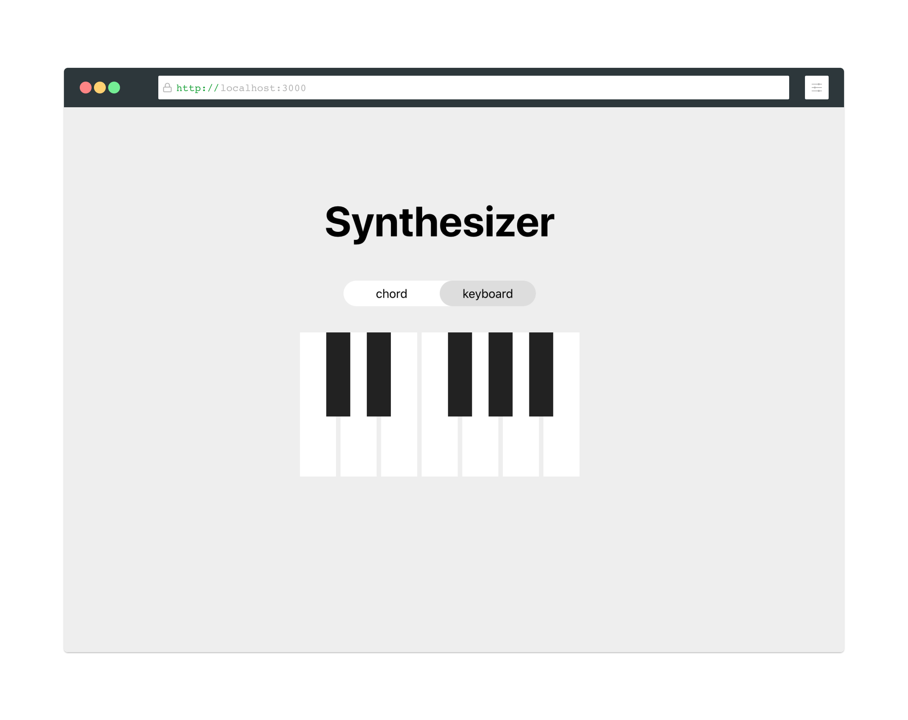

# Synthesizer
A minimal synthesizer with two modes - Keyboard and Chord, developed using Next.js and Tone.js (a web audio framework).

## Getting started
1. Clone the project
2. Setup project with `npm install`
3. Run `npm run dev` to start the application in development mode

## Resources
- [Next.js](https://nextjs.org/)
- [Tone.js](https://tonejs.github.io/)

## Inspired by
- [Virtual Synth](https://github.com/gauthammk/Virtual-Synth)
- [Harmopark](https://www.harmopark.app/)